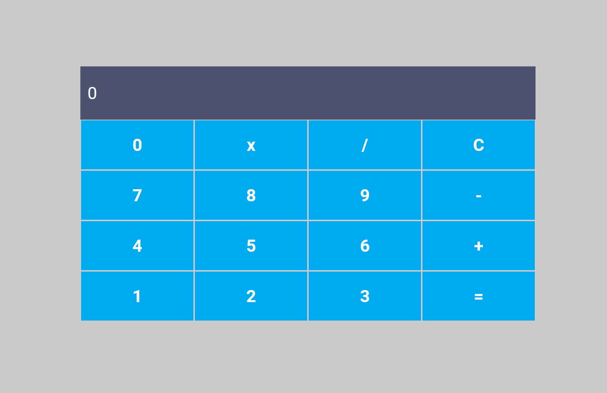

<h1 align="center">
 
</h1>

# Calculadora simples

Este é um projeto foi criado como o primeiro desafio da trilha react
do Bootcamp Orange Tech+, patrocinado pelo banco Inter e ministrada pela DIO.

## Tarefas:

- Copiar ou dar um "fork" no [Repositório do GitHub](https://github.com/digitalinnovationone/trilha-react-desafio01-calculadora)
- Fazer a funcionalidade para calcular a multiplicação
- Fazer a funcionalidade para calcular a divisão
